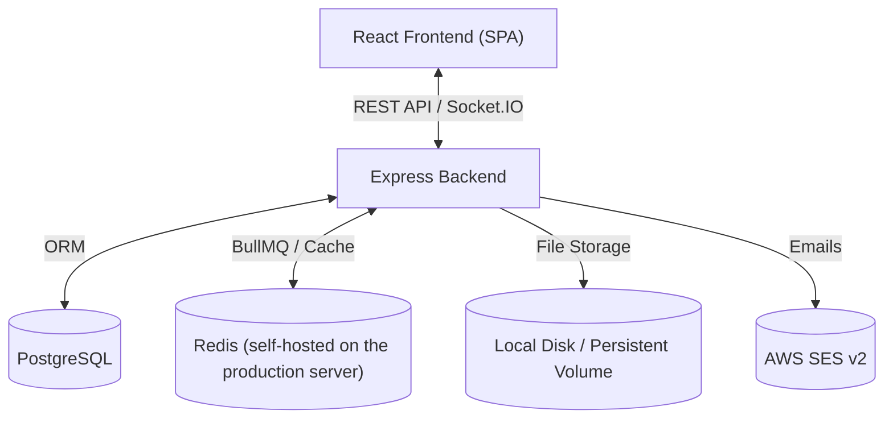
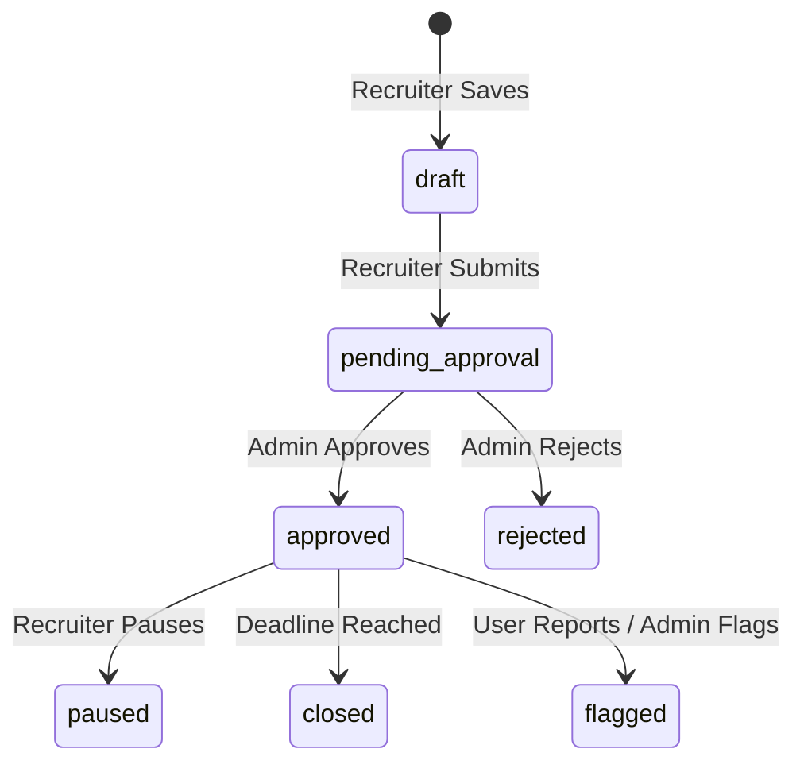

# 1. Project Overview

## 1.1 Purpose of the Project
JobsForWomen.info is a specialized recruitment platform designed to connect female job seekers with progressive employers. The platform prioritizes workplace benefits and features that address historical barriers to women's employment, such as menstrual leave policies, flexible hours, work-from-home options, and women returnship programs.

## 1.2 Business Objectives
* **Promote Gender Diversity**: Help organizations achieve their diversity and inclusion goals by providing a targeted pipeline of qualified female talent.
* **Advocate for Progressive Benefits**: Encourage employers to adopt progressive policies (e.g., Menstrual Leave, Flexible Hours) by labeling and prioritizing them on the platform.
* **Support Career Re-entry**: Provide dedicated paths for women returning to the workforce after career breaks (e.g., maternity or caregiving) via "Women Returnship" opportunities.
* **Safe & High-Quality Listings**: Enforce safety and platform standards through a rigorous recruiter company verification and job moderation lifecycle.

## 1.3 User Roles
The platform models three primary user types, each with segregated routing and dashboards:

| User Role | Description | Core Responsibilities |
| :--- | :--- | :--- |
| **Candidate** | Job seekers seeking roles. | Build profile, upload resume, search and filter jobs, submit applications, receive real-time notifications. |
| **Recruiter** | Talent acquisition users representing companies. | Manage company profile, upload logo, post job vacancies, manage candidates, invite colleague recruiters, review applications. |
| **Admin / Super Admin** | Platform operators. | Moderate job postings, verify company accounts, monitor platform health, configure feature flags, audit system actions. |

---

## 1.4 Technology Stack

The platform is designed with a modern Node.js backend and a React single-page application (SPA) frontend.

### Core Technologies:
* **Frontend**: React 19, TypeScript, Vite, Framer Motion, Tailwind CSS, Lucide icons, Sonner (Toasts).
* **Backend**: Node.js, Express, TypeScript, Zod (Validations), Multer (Multipart parser).
* **Database & ORM**: PostgreSQL, Prisma ORM.
* **Asynchronous Tasks & Caching**: Redis (self-hosted on the production server; in-process fallback when unavailable), BullMQ (Queue processing).
* **Real-Time WebSockets**: Socket.IO.
* **File Storage**: Local disk on a persistent volume, served via a signed-URL route (`/files/jfw/...`). Migrated off Cloudinary; no third-party storage provider is used.
* **External Providers**: AWS SES (Transactional emails, region `ap-south-1`), Google (OAuth).

---

## 1.5 High-Level Architecture & Core Modules

### 1. Unified Authentication & RBAC
An Express-based authentication layer validating JWT tokens and handling refresh tokens via secure cookies. Dynamic RBAC middlewares ensure routes are restricted based on permissions cached in Redis.

### 2. Job Moderation Lifecycle
A state machine that prevents jobs from being visible until approved by an administrator.

### 3. Verification and Auditing
Colleague invites and company registration audits log actions to `AuditLog`. Company profile updates require Admin approval to be fully verified.

### 4. Real-time Notification Engine
Leverages BullMQ background workers and EventBus listeners to trigger real-time browser alerts (via Socket.IO namespaces) and emails (via AWS SES) when applications are updated or jobs are moderated.
