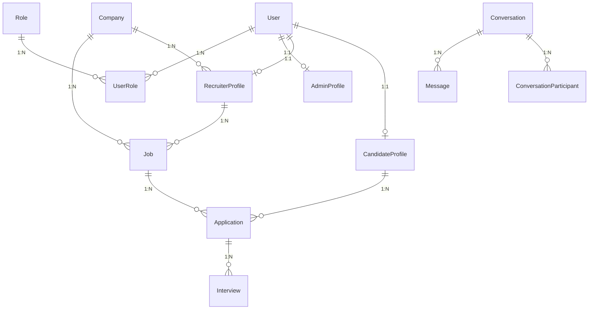

# 5. Database Documentation

The platform uses a **PostgreSQL** database managed through the **Prisma ORM**. The schema is defined in `backend/prisma/schema.prisma`.

---

## 5.1 Enums

| Enum Name | Options | Description |
| :--- | :--- | :--- |
| **`UserStatus`** | `PendingVerification`, `PendingApproval`, `Active`, `Rejected`, `Suspended`, `Blocked` | Accounts verification and moderation state. |
| **`CompanyStatus`** | `draft`, `submitted`, `pending`, `pending_verification`, `under_review`, `approved`, `rejected`, `info_requested` | Lifecycle states for company verification. |
| **`JobStatus`** | `draft`, `pending_approval`, `approved`, `paused`, `closed`, `archived`, `flagged` | States for job postings moderation. |
| **`JobVisibility`** | `visible`, `hidden` | Controls if job is discoverable in candidate feeds. |
| **`WorkMode`** | `Remote`, `Hybrid`, `On_site` | Physical location policy for jobs. |
| **`ApplicationStatus`**| `Applied`, `Reviewed`, `Shortlisted`, `InterviewScheduled`, `OfferReleased`, `Rejected`, `Hired` | Lifecycle phases of a job application. |

---

## 5.2 Core Models & Relationships

### 1. User & Profiles
* **`User`**: Root identity record storing emails, statuses, passwords, and linking roles.
* **`CandidateProfile`**: Stores resume metadata (JSON), education, and experience. Linked to `User` via `userId` with `onDelete: Cascade`.
* **`RecruiterProfile`**: Holds company association (`companyId`) and recruiter status.
* **`AdminProfile`**: Stores platform admins' names.

### 2. Authorization (RBAC)
* **`Role`**: Represents platform capabilities (e.g., `Super Admin`, `Recruiter`, `Candidate`).
* **`Permission`**: Granular operations (e.g., `manage:job`, `manage:users`).
* **`RolePermission`**: Bridge table connecting roles to permissions.
* **`UserRole`**: Bridge table associating users with roles.

### 3. Hiring & Company Infrastructure
* **`Company`**: Represents corporations. Stores location, industry, verification status, and benefits.
* **`CompanyBenefit`**: Tracks special policies (like Menstrual Leave Champion) verified by admins.
* **`Job`**: Represents job postings. Stores title, skills required (`JobSkill`), salary ranges, and visibility status.
* **`Application`**: Candidate applications for jobs.
* **`SavedJob`**: Job bookmarks saved by candidates.

### 4. Communications & Messaging
* **`Conversation`**: Handles real-time messaging channels.
* **`ConversationParticipant`**: Associates users to conversations.
* **`Message`**: Stores messages with content, senderId, and `readAt` timestamps.

---

## 5.3 Database Constraints & Cascading Deletions

The schema uses foreign-key constraints to guarantee database integrity. Major cascading deletion pathways include:

1. **Delete User**:
   * Cascade deletes `CandidateProfile` | `RecruiterProfile` | `AdminProfile`.
   * Cascade deletes user-associated helper sessions: `UserRole`, `RefreshToken`, `Session`, `OAuthAccount`, `Notification`, and `ConversationParticipant`.
   * Nullifies `AuditLog.operatorId` (`onDelete: SetNull`).
2. **Delete CandidateProfile**:
   * Cascade deletes candidate applications (`Application`), skills (`CandidateSkill`), and bookmarks (`SavedJob`).
3. **Delete Job**:
   * Cascade deletes applications (`Application`), bookmarks (`SavedJob`), reports (`JobReport`), and job skills (`JobSkill`).
4. **Delete Application**:
   * Cascade deletes related `Interview` records and application status histories (`ApplicationStatusHistory`).

---

## 5.4 Seed Strategy

The seed script (`backend/src/database/seed.ts`) populates:
1. **Roles**: `Candidate`, `Recruiter`, `Moderator`, `Admin`, `Super Admin`, and `Support Executive`.
2. **Permissions**: Map actions (e.g., `moderate:job`, `manage:users`, `manage:features`).
3. **Role-Permission Joins**: Binds permissions to roles (RBAC matrix).
4. **Platform Constants**: Seeds `Departments` (IT, Marketing, etc.) and `Industries` (Tech, Finance, etc.).
5. **Default Admin**: Inserts the default Super Admin user `admin@jobsforwomen.info` (password `admin123`).
6. **Mock Data**: Generates test companies, recruiters, candidates, and job postings for development.
