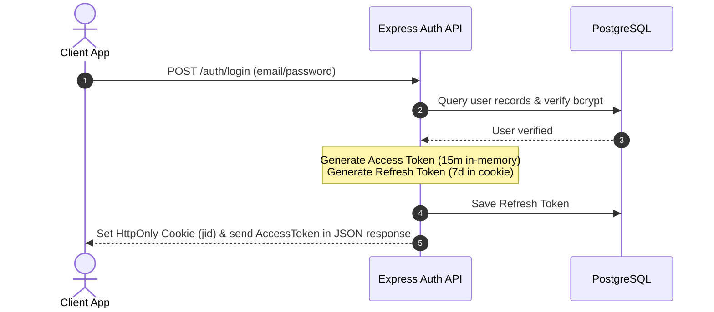
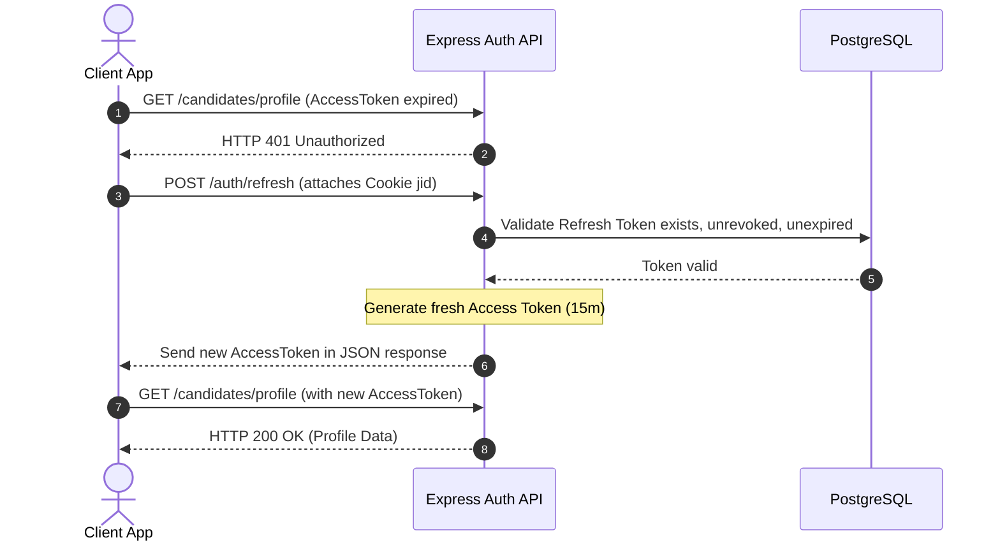

# 9. Authentication Flow

The platform relies on a dual JWT authentication model combined with Google OAuth capabilities.

---

## 9.1 JWT Access & Refresh Token Architecture

The authentication system segments responsibilities between two tokens:

1. **Access Token (In-Memory)**:
   * Signed with `env.JWT_ACCESS_SECRET`.
   * Has a lifetime of 15 minutes (`JWT_ACCESS_EXPIRY`).
   * Contains non-sensitive payload parameters: user ID, email, and roles array.
   * Transmitted in client headers as a bearer token (`Authorization: Bearer <token>`).
2. **Refresh Token (HttpOnly Cookie)**:
   * Signed with `env.JWT_REFRESH_SECRET`.
   * Has a lifetime of 7 days (`JWT_REFRESH_EXPIRY`).
   * Stored in a database record (`RefreshToken` model) mapping the user connection.
   * Sent to the client via an `HttpOnly` browser cookie (`jid`), `Secure` in every non-local environment. `SameSite` is `None` in production (the SPA and API are on different origins) and `Lax` for local development — see [18. Security](18_SECURITY.md) §18.2 for the full flag breakdown. This prevents cross-site scripting (XSS) extraction of the refresh token.

---

## 9.2 Token Refresh & Re-authentication Flow

When the client access token expires:

---

## 9.3 Google OAuth Integration

Google OAuth processes are handled via the standard API authentication loop:

1. **Authorization URL**: The client redirects the user to the Google Consent screen pointing to:
   `https://accounts.google.com/o/oauth2/v2/auth?client_id=...&redirect_uri=...`
2. **Callback Handling**:
   * Google redirects the client to the backend route `GET /api/v1/auth/google/callback` with an authorization `code`.
   * The backend exchanges this `code` for user profile details and tokens.
   * If the email does not exist, the backend registers a new User, associates their OAuth credentials in the `OAuthAccount` table, and sets their status directly to `Active`.
   * The backend sets the `jid` refresh token cookie and redirects the browser back to the frontend dashboard base:
     `res.redirect(frontendUrl + "/auth/oauth-success?token=" + accessToken)`

---

## 9.4 Verification & Password Recovery Lifecycles

### 1. Email Verification
* Newly registered accounts are assigned `UserStatus.PendingVerification` and a verification token is written to the `EmailVerification` table.
* A welcome email containing a unique link (`/verify-email?token=<token>`) is queued and dispatched.
* When visited, the backend verifies the token hasn't expired and shifts the user status to `Active`.
* **Verification Bypass**: If `BYPASS_EMAIL_VERIFICATION=true` is set, verification links are skipped and registrations default to `Active` immediately.

### 2. Password Recovery
* **Request**: User requests recovery via `POST /api/v1/auth/forgot-password`.
* **Generation**: The system writes a single-use token to `PasswordReset` table with a 1-hour expiration.
* **Email Dispatch**: An email is dispatched with the link `/reset-password?token=<token>`.
* **Reset**: The user visits the link, submits a new password, and the backend hashes it using `bcrypt` (10 rounds) and marks the reset token as used.
